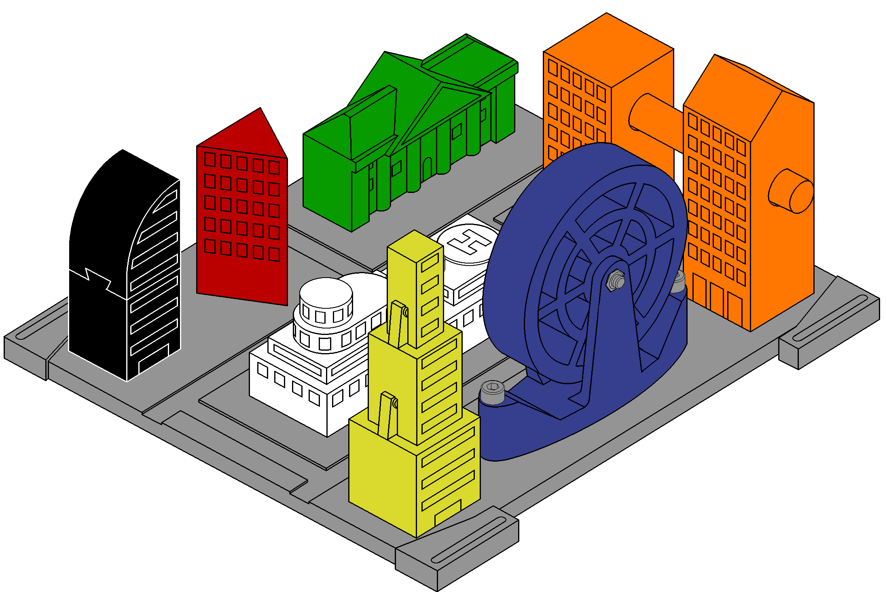
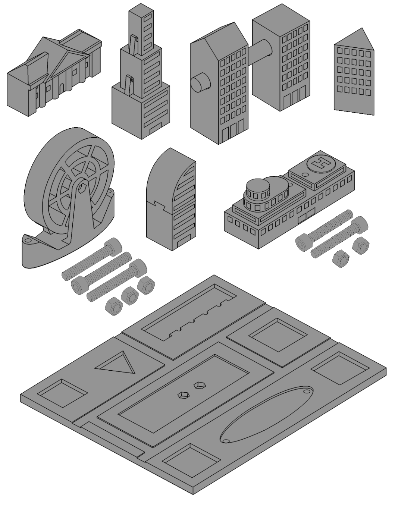
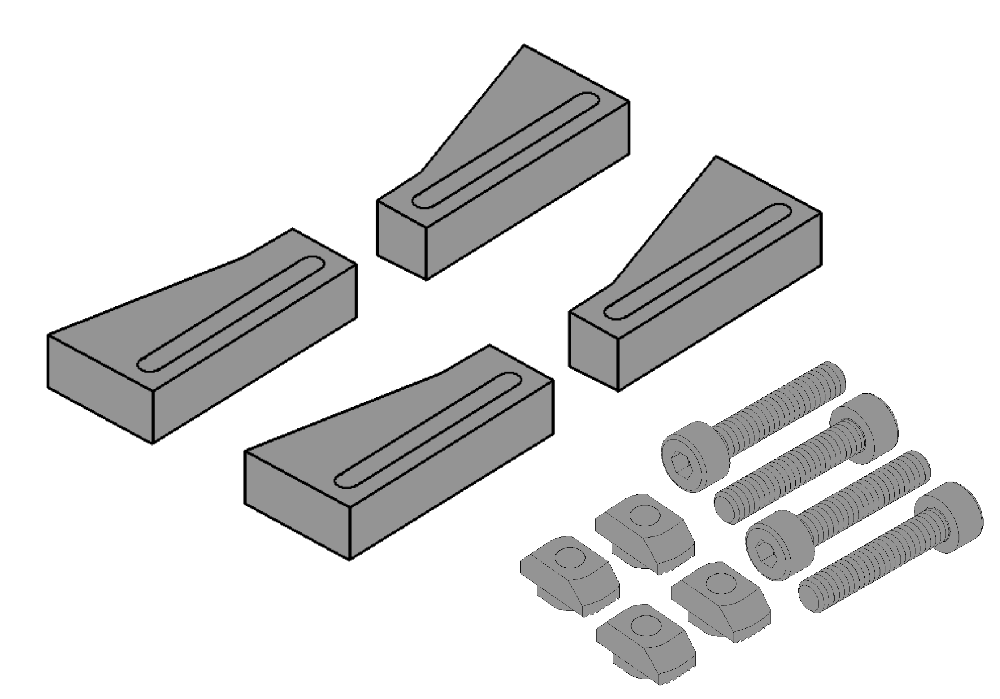

# Collaborative Tasks Benchmark (CT Benchmark)

    

## Introduction
Benchmarks are crucial to help robotics research advance in an efficient and standardized manner, however, the collaborative assembly field lacks a benchmark with multiple tasks of varying task complexity. As such, we propose the Collaborative Tasks Benchmark (CT Benchmark). It contains 7 distinct tasks ranging from easy to difficult assembly scenarios, each with 1 to 3 parts, providing a rich environment for studying collaborative assembly systems. Its design was grounded on the following criteria:

- Contain independent sequential assembly tasks 
- Tasks have a wide variety of sturdy and graspable 3D printable pieces
- Each piece has its own distinguishable features. 

The benchmark mainly focuses on assisting in the development of collaborative systems, though it is also applicable towards
any combination of its inherent sub-systems: task sequencing allocation, fully-robotic assembly, robot pick-and-place operations and visual perception.

## Task description
The proposed benchmark is representative of a city landscape and contains a total of 7 unique tasks. The main assembly operations are wide tolerance insertion (WTI), tight tolerance insertion (TTI), screw fastening, snap fitting and two-handed actions.

| Building | Color                                                                                           | # of parts | WTI   | TTI   | Screw | Snap-fit | Two-handed |
| :------: | :---------------------------------------------------------------------------------------------: | :--------: | :---: | :---: | :---: | :------: | :--------: |
| Museum   |   | 1          | ✓     |       |       |          |            |
| Snap     |  | 3          | ✓     | ✓     |       | ✓        |            |
| Bridge   |  | 3          | ✓     | ✓     |       |          |            |
| Triangle |     | 1          | ✓     |       |       |          |            |
| Wheel    |    | 2          | ✓     |       | ✓     |          | ✓          |
| Dovetail |   | 2          | ✓     | ✓     |       |          |            |
| Hospital |   | 3          | ✓     |       | ✓     |          |            |

## Benchmark deployment

<table>
  <thead>
    <tr>
      <th>Essential hardware</th>
      <th>Optional hardware</th>
    </tr>
  </thead>
  <tbody>
    <tr>
      <td>
        
      </td>
      <td>
        
      </td>
    </tr>
    <tr>
      <td>
        <b>3D printed buildings and base:</b>
        <ul>
          <li>520g of PLA</li>
          <li>25 hours</li>
        </ul>
        <b>Fasteners:</b>
        <ul>
          <li>M5 x 30 screws (x5)</li>
          <li>ISO 4032 M5 nuts (x5)</li>
        </ul>
      </td>
      <td>
        <b>3D print corner pieces:</b>
        <ul>
            <li>20g of PLA</li>
            <li>1 hour</li>
          </ul>
          <b>Fasteners:</b>
          <ul>
            <li>M4 x 20 screws (x4)</li>
            <li>Adequately sized M4 T-nuts (x4)</li>
          </ul>
      </td>
    </tr>
  </tbody>
</table>
