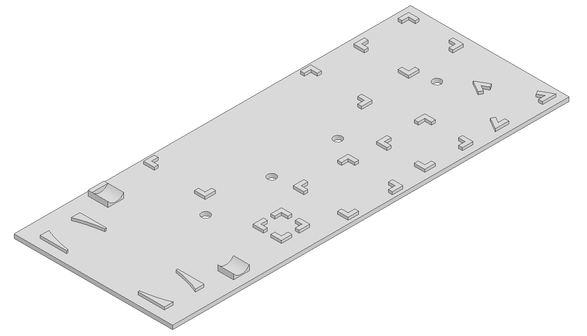

## Additional 3D printable supports

In addition to the essential and optional hardware, three supports are made available to aid the assembly process.
These supports were used to guarantee a repeatable setup in the accompanying article while performing the proposed manufacturing assembly scenarios.

All supports can be fixed to a T-slot aluminium extrusion frame, with the use of screws and T-nuts.

## Part description

<table>
  
  <thead>
    <tr>
      <th>Image</th>
      <th>Intended use</th>
    </tr>
  </thead>
  
  <tbody>
    <tr>
      <td>
        

          </td>
        

      <td>
        Hold the screws in an upright position for easy access to the user
        

        <b>Fasteners:</b>
          <ul>
            <li>M6 x 12 screws (x2)</li>
            <li>Adequately sized M6 T-nuts (x2)</li>
          </ul>
      </td>
    </tr>
    <tr>
      <td>
          </td>
      <td>
        Hold the benchmark parts intended to be picked up by the collaborative robot
        

        <b>Fasteners:</b>
          <ul>
            <li>M6 x 12 screws (x4)</li>
            <li>Adequately sized M6 T-nuts (x4)</li>
          </ul>
      </td>
    </tr>
    <tr>
      <td></td>
      <td>
        Hold the benchmark parts intended to be picked up by the human operator
        

        <b>Fasteners:</b>
          <ul>
            <li>M6 x 12 screws (x4)</li>
            <li>Adequately sized M6 T-nuts (x4)</li>
          </ul>
      </td>
    </tr>
  </tbody>
  
</table>
